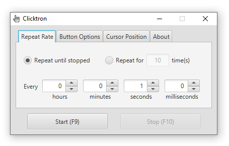

# Clicktron
An auto clicker and key presser application written in Java. Just specify the repeat rate, which button to press, how many times to press and other settings. The application will press the same button over and over for you without getting bored. This project can be used by software developers to comprehend how to use JavaFX application platform and MVP design pattern.

## Screenshot

## Distinguishing Features
* The application is completly free, without any time or feature limitation.
* Keyboard keys can also be selected to press in repeat just as mouse buttons.

## Known issues
* Shortcut keys do not function if the application window does not have focus. (Unfortunately, the problem is difficult to solve without using any third-party library like [JNativeHook](https://github.com/kwhat/jnativehook))
* Only keyboard keys available in US keyboard layout can be selected for pressing.
* On Ubuntu, although the application starts; it does not function as expected.

## Requirements
[Java 8](https://www.java.com/download/) or newer has to be installed on the computer. If you are using Java 11 or newer, you need to download JavaFX libraries separately, since JavaFX libraries are not shipped with JDKs anymore.
